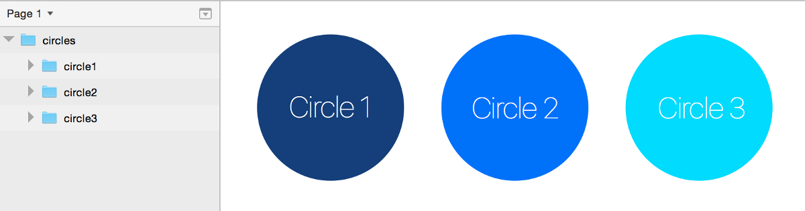
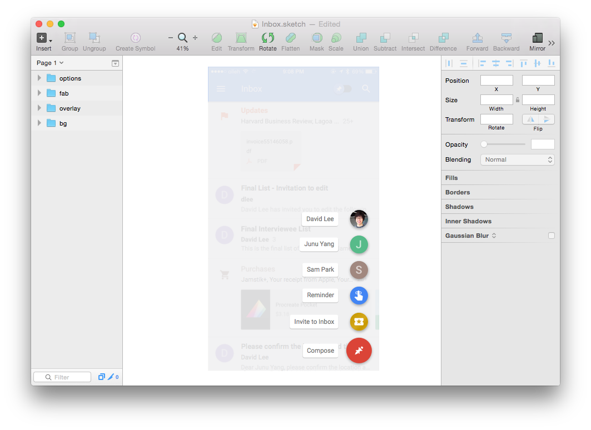
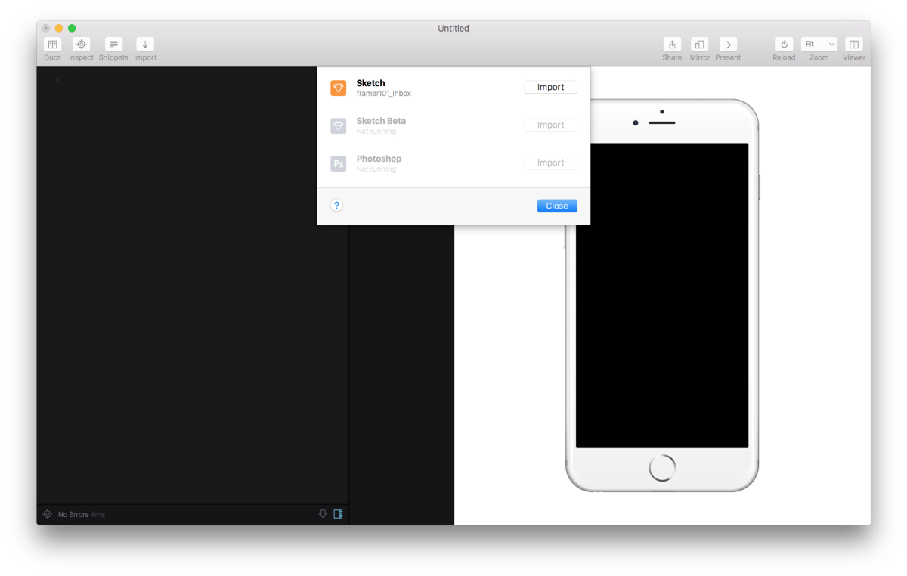

# Framer Tutorial

##Introduction

Framer.js (Framer) is a prototyping tool that allows UX designers to create interactive animated prototypes.

This lesson guide is adapted from [David Lee’s](https://twitter.com/designforhuman) excellent Medium post entitled [“New to Framer?
Just 3 Things to Get You Started”](https://medium.com/@designforhuman/new-to-framer-just-3-things-to-get-you-started-47397f27c71e#.80jvxpgm0)

## Basic Concepts

###Coffeescript

Framer is built upon Coffeescript, which is a simpler way of writing Javascript.

Coffescript, like many scripting languages, is built upon variables, conditions, functions, arrays, and objects.

####Variables

*Cara to add definition*

````
// Javascript
number = 42;

# Coffescript
number = 42
````

````
// Javascript
opposite = true;

# Coffeescript
opposite = true
````

####Conditions

*Cara to add definition*

````
// Javascript
if(opposite) {
    number = -42;
}

# Coffescript
number = -42 if opposite
````

####Objects

*Cara to add definition*

````
// Javascript
addressBook = {
    firstName: "Michael",
    lastName: "Yap"
};

# Coffescript
addressBook =
    firstName: "Michael"
    lastName: "Yap"
````

####Arrays

*Cara to add definition*

````
// Javascript
shoppingList = [
    eggs,
    milk,
    bread
];

# Coffeescript
shoppingList = [
    eggs,
    milk,
    bread
]
````

####Functions

*Cara to add definition*

````
// Javascript
square = function(x) {
    return x * x;
}

# Coffeescript
square = (x) -> x * x
````

###Dot Notation

When you import a Sketch file into Framer, you'll see a new line similar to the one below.

`example = Framer.Importer.load “imported/example”`

In the real world, objects have properties. For example, imagine a red balloon. A balloon is an object; color is one of its many properties; this balloon’s color property is red. In Javascript, we can access an object's properties using dot notation.

````
# Access the the balloon's color and set it to blue
balloon.color = "blue"
````

To access and change properties of objects drawn in Sketch we can use dot notation to access nested objects.

For example, say you've drawn three circles in Sketch and you wish to change their size in Framer.



````
# Access circles via dot notation and update its scale property
example.circles.scale = 1.2
````
###Indentation

Just as dots are significant in Framer, so are indents.

Indents are used to indicate parent-child relationships.

````
function = ->
    layer.animate
        properties:
           opacity: 1
           rotation: 90
````

In the example above, `opacity` and `rotation` are children of `properties`.

`properties` is a child of `layer.animate`.

`layer.animate` is a child of `function`.

###Agency

Humans have the capacity to act by our own free will. We laugh. We love. We move through space. Walking in the woods, we brush (an event) a branch (an object) away from our face.The  branch bends (a state change).

In Framer, events, objects, and states are the key ingredients for creating interactive animated prototypes.

####Layers

We can think of objects we act upon in the real world as layers in Framer.

Framer's [documentation](http://framerjs.com/learn/basics/) defines a layer as:

> …a rectangle that draws elements. Layers can display images, videos or text. Every layer inherits a set of default properties: width, height and a blue background.

####States

Layers can have multiple states, or, different ways of appearing. In one state, a circle may appear small, in a subsequent state, it may appear large. Layers may switch from state-to-state with or without animation.

####Events

Interactivity lets objects on screen react to something a user does: moving a mouse over a navigation button produces a menu of links; selecting a radio button reveals a new set of form options; clicking a small photo makes the page darken and a larger version of the photo pop onto the screen.

User actions that a Framer prototype can respond to are called events.

To make your Framer prototype interactive, you write actions (functions) that respond to events.

Framer allows you to "listen" to many events: click events, touch events, scroll events, drag events and more.

````
# Listen to when the user clicks upon a layer name "layerA"
layerA.on Events.Click, ->
    # Awesome code here
````

One of the most comment uses of events toggling between a set of states on click

````
# Toggle states on click
menuButton.on Events.Click, ->
    menu.states.next()
````

##Lab 1: Messing around with Google Inbox

**Step 1: Open and inspect "Inbox.sketch"**



Note how each layer is named. ("fab" is an acronym for "floating action button".) We'll use Sketch's naming convention in the dot notation we'll write in Framer to access each layer's properties.

**Step 2: Create a new Framer document and import the Sketch file**



**Step 3: Rename the default variable to "inbox"**

Now you can access all layers in the Sketch file through the variable `inbox`.

`inbox.fab.scale = 1.2`

**Step 4: Write a program in psuedocode**

Let's describe a simple program in human language: when the user clicks on the Floating Action Button (FAB), make it disappear.

Let's describe the program in terms of property values that Framer will understand: when the user clicks on the FAB, set the FAB's opacity to zero.

**Step 5: Translate the psuedocode to actual code**

First, listen for when users click on the FAB…

````
inbox.fab.on Events.Click, ->
    # Confirm event listening is working properly
    print "Click fired"
````
Second, assign an action…

````
inbox.fab.on Events.Click, ->
    # Make the button disappear
    inbox.fab.opacity = 0
````

**Step 6: Divide the click event into two events: press and release**

````
inbox.fab.on Events.TouchStart, ->
    inbox.fab.opacity = 0

inbox.fab.on Events.TouchEnd, ->
    inbox.fab.opacity = 1
````

David notes:

>You may wonder what *.on*, *comma*, and *arrow(->)* notations are. But you can just think this is the way to assign an event to a layer. 

(For the curious, learn more about [.on](http://framerjs.com/docs/#layer.on) and [functions](http://framerjs.com/learn/coffeescript/).)

**Step 7: Describe alternative states**

Think back to walking in the woods. The branch that is in your path has an state prior to you brushing it aside (unbent) and a state after you've brushed it aside (bent).

Prototyping in Framer can be thought of assigning layers different states based upon how users interact with them.

Another way to think of it: when users act upon a layer, users change the layer’s state.

For Framer to keep track of how layers change from state-to-state, we must define them.

````
inbox.fab.states.add 
    default:
        opacity: 1
        scale: 1
    fadeout:
        opacity: 0
        scale: 1.5

inbox.fab.on Events.TouchStart, ->
    this.states.switch("fadeout")

inbox.fab.on Events.TouchEnd, ->
    this.states.switch("default")
````
    
**Step 8: Modify how the FAB animates between states**

When creating motion studies with Keynote, UX designers often rely on Keynote’s “Magic Move” functionality.

One one hand, Magic Move is great—we are quickly able to sketch change over time. On the other hand, we don’t have the ability to control *how* Keynote animates objects from one state to another.

Fortunately, Framer gives us fine control of animation effects via `.animationOptions`.

`inbox.fab.states.animationOptions = curve: "spring(300, 30, 0)"`

David notes:

>There are some ways to define the type of animations. But *spring* gives the most natural results. So most of the time you use *spring* instead of *linear* or *ease*. The three values inside the parentheses are [tension, friction, and velocity](http://nlevin.com/framer/#26) in order. I mostly find right animation by adjusting *tension* and *friction* leaving *velocity* as 0. I just start with “300, 30, 0” then change them later. You can play with them in Noah Levin’s [tutorial page](http://nlevin.com/framer/#27).

##Lab 2: Bringing Google Inbox to life

Here‘s what we‘re going to make…


**Step 1: Write a program in psuedocode** 

When the user presses the Floating Action Button rotate the plus icon:

* Rotate the plus icon ninety degrees
* Fade out the plus icon
* Rotate the write icon ninety degrees
* Fade in the plus icon
* Fade in the overlay layer
* Fade in the options layer

When the user presses the overlay layer, reverse all corresponding animations.

**Step 2: Hide the `options`, `icon_write`, and `overlay` layers**

````
inbox.options.opacity = 0
inbox.icon_write.opacity = 0
inbox.overlay.opacity = 0
````

**Step 3: Define the states described in psuedocode**

Create states for `options` and `overlay` that display them 100% opaque…

````
inbox.overlay.states.add
    on:
        opacity: 1
inbox.overlay.states.animationOptions = curve: "spring(300, 30, 0)"
        
inbox.options.states.add
    on: 
        opacity: 1
inbox.options.states.animationOptions = curve: "spring(300, 30, 0)"
````

**Step 4: Make `overlay` disappear when clicked**

````
inbox.overlay.on Events.Click, ->
    this.states.switch("default")
````
**Step 5: Animate the plus and write icons**

Set the write icon's default state by rotating it negative ninety degrees…

`inbox.icon_write.rotation = -90`

Describe a state for the write icon when the FAB is clicked…

````
#Write Icon States
inbox.icon_write.states.add
    on: 
        rotation: 0
        opacity: 1
inbox.icon_write.states.animationOptions = curve: "spring(500, 30, 0)"
````

Describe a state for when the plus icon is clicked…

````
#Plus Icon States
inbox.icon_plus.states.add 
    on:
        rotation: 90
        opacity: 0
inbox.icon_plus.states.animationOptions = curve: "spring(500, 30, 0)"
````

Update the click events…

````
#FAB Events
inbox.fab.on Events.Click, ->
    # print "I fired"
    inbox.overlay.states.switch("on")
    inbox.options.states.switch("on")
    inbox.icon_write.states.switch("on")
    inbox.icon_plus.states.switch("on")

#Overlay Events
inbox.overlay.on Events.Click, ->
    this.states.switch("default")
    inbox.options.states.switch("default")
    inbox.icon_write.states.switch("default")
    inbox.icon_plus.states.switch("default")
````

**Finished code**

````
# This imports all the layers for "Inbox" into inbox
inbox = Framer.Importer.load "imported/Inbox"

inbox.options.opacity = 0
inbox.icon_write.opacity = 0
inbox.icon_write.rotation = -90
inbox.overlay.opacity = 0

#Options States
inbox.options.states.add
    on: 
        opacity: 1
inbox.options.states.animationOptions = curve: "spring(300, 30, 0)"

# Overlay States
inbox.overlay.states.add
    on:
        opacity: 1
inbox.overlay.states.animationOptions = curve: "spring(300, 30, 0)"

#Plus Icon States
inbox.icon_plus.states.add 
    on:
        rotation: 90
        opacity: 0
inbox.icon_plus.states.animationOptions = curve: "spring(500, 30, 0)"

#Write Icon States
inbox.icon_write.states.add
    on: 
        rotation: 0
        opacity: 1
inbox.icon_write.states.animationOptions = curve: "spring(500, 30, 0)"

#FAB Events
inbox.fab.on Events.Click, ->
    # print "I fired"
    inbox.overlay.states.switch("on")
    inbox.options.states.switch("on")
    inbox.icon_write.states.switch("on")
    inbox.icon_plus.states.switch("on")

#Overlay Events
inbox.overlay.on Events.Click, ->
    this.states.switch("default")
    inbox.options.states.switch("default")
    inbox.icon_write.states.switch("default")
    inbox.icon_plus.states.switch("default")
````


